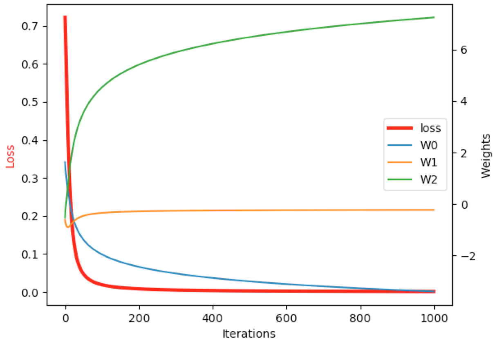
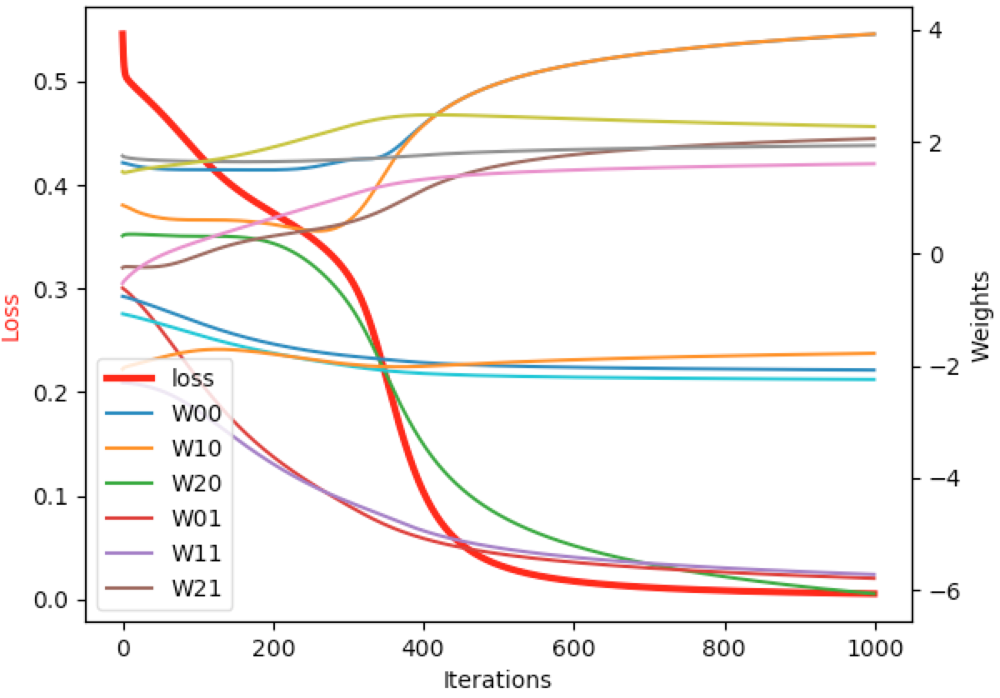

# simple-neural-nets

This repo is derived from the [blog](https://iamtrask.github.io/2015/07/12/basic-python-network/) by @iamtrask.

I added and changed a few things for educational purposes. In particular, I spelled out key functions, modified the update rule, and plotted out the losses and weights. I also added "rev" scripts which flip the matrices and dot products.

As @iamtrask mentioned, I found it very helpful to try writing these networks from memory.

# Usage

Each script has an argument for plotting:

```
python two_layer_nn.py --plot
```



```
python three_layer_nn.py --plot
```

